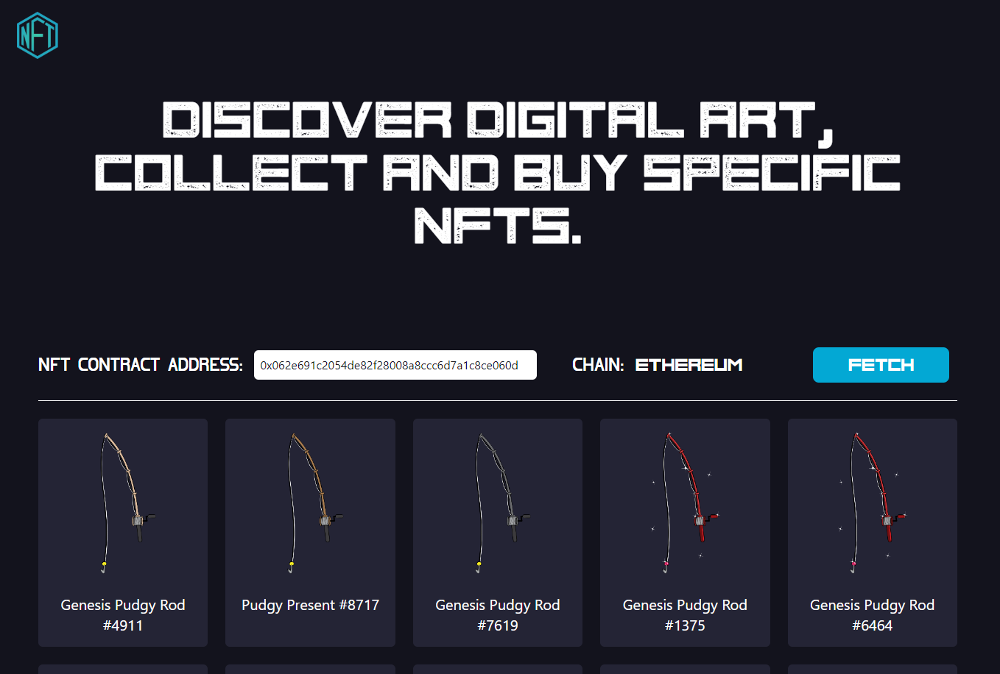

# List of NFTS

This is using [React.JS](https://reactjs.org/) and [TailwindCSS](https://tailwindcss.com/).
- This is working on Ethereum Mainnet.
- You should input NFT contract address to fetch data.

# Installation

-   Clone repo
-   Run `yarn` or `npm i`
-   Run `yarn build` or `npm run build`
-   Run `yarn start` or `npm run start`
-   See `http://localhost:3000/`